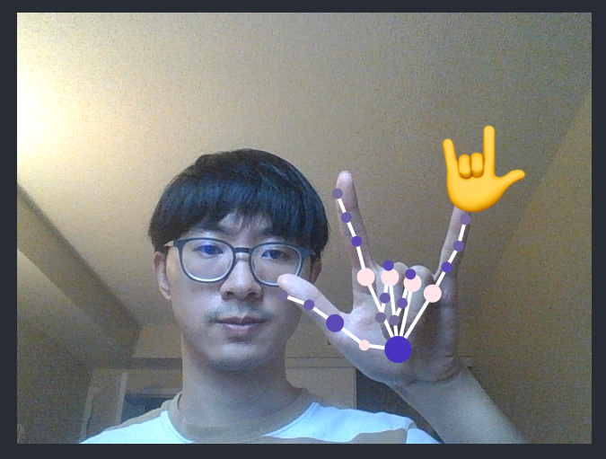

This is a simple web cam based hand gesture recognition React app. Credit to: [__Nicholas Renotte__] (https://github.com/nicknochnack/GestureRecognition)

Tools and packages used: React, TensorFLow, fingerpose.

I followed Nicholas' Youtube video and finished this project. Besides "Thumbs Up" and "Victory", I added two more gestures "OK" and "Love You".

